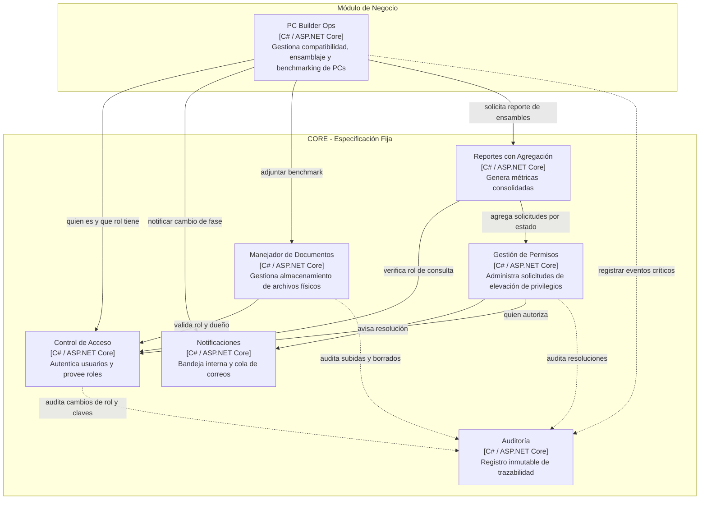

# PC Builder Ops

> **Sistema de Gestión de Ensamblaje y Pruebas de Computadoras Custom**  
> Proyecto de la asignatura **Programación III (TDS-007)** — ITLA (2026-C-3)

---

## Descripción del Proyecto
Plataforma orientada a talleres técnicos y tiendas especializadas de hardware para gestionar el ciclo operativo completo de computadoras personalizadas a pedido. El sistema valida la compatibilidad física y eléctrica de los componentes durante la cotización, coordina las etapas de montaje físico, y garantiza el control de calidad mediante el registro de pruebas de estrés térmico y estabilidad (benchmarking) antes de autorizar la entrega final al cliente.

## Stack Tecnológico
* **Lenguaje:** C# / .NET 10 (ASP.NET Core Web API)
* **Persistencia:** Entity Framework Core con base de datos relacional (SQL Server)
* **Arquitectura:** Diseño basado en componentes (C4 Nivel 3) con desacoplamiento estricto del Core

---

## Arquitectura del Sistema (Diagrama C4 Nivel 3)
El sistema se compone de seis piezas fijas del Core y el módulo de negocio independiente:

