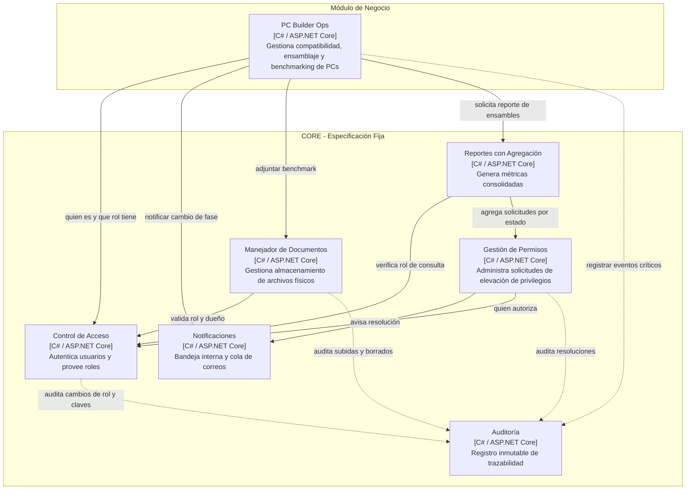

# PC Builder Ops

> **Sistema de Gestión de Ensamblaje y Pruebas de Computadoras Custom**  
> Proyecto de la asignatura **Programación III (TDS-007)** — ITLA (2026-C-3)

---

## Descripción del Proyecto
Plataforma orientada a talleres técnicos y tiendas especializadas de hardware para gestionar el ciclo operativo completo de computadoras personalizadas a pedido. El sistema valida la compatibilidad física y eléctrica de los componentes durante la cotización, coordina las etapas de montaje físico, y garantiza el control de calidad mediante el registro de pruebas de estrés térmico y estabilidad (benchmarking) antes de autorizar la entrega final al cliente.

## Stack Tecnológico
* **Lenguaje:** C# / .NET 10 (ASP.NET Core Web API)
* **Persistencia:** Entity Framework Core con base de datos relacional (SQL Server)
* **Arquitectura:** Diseño basado en componentes (C4 Nivel 3) con desacoplamiento estricto del Core

---

## Arquitectura del Sistema (Diagrama C4 Nivel 3)
El sistema se compone de seis piezas fijas del Core y el módulo de negocio independiente:


```mermaid
flowchart TD
    subgraph Core["CORE - Especificación Fija"]
        CA["Control de Acceso<br/>[C# / ASP.NET Core]<br/>Autentica usuarios y provee roles"]
        GP["Gestión de Permisos<br/>[C# / ASP.NET Core]<br/>Administra solicitudes de elevación de privilegios"]
        DOC["Manejador de Documentos<br/>[C# / ASP.NET Core]<br/>Gestiona almacenamiento de archivos físicos"]
        NOTI["Notificaciones<br/>[C# / ASP.NET Core]<br/>Bandeja interna y cola de correos"]
        REP["Reportes con Agregación<br/>[C# / ASP.NET Core]<br/>Genera métricas consolidadas"]
        AUD["Auditoría<br/>[C# / ASP.NET Core]<br/>Registro inmutable de trazabilidad"]
    end

    subgraph Negocio["Módulo de Negocio"]
        MOD["PC Builder Ops<br/>[C# / ASP.NET Core]<br/>Gestiona compatibilidad, ensamblaje y benchmarking de PCs"]
    end

    GP -->|"avisa resolución"| NOTI
    GP -->|"quien autoriza"| CA
    DOC -->|"valida rol y dueño"| CA
    REP -->|"verifica rol de consulta"| CA
    REP -->|"agrega solicitudes por estado"| GP

    CA -.->|"audita cambios de rol y claves"| AUD
    GP -.->|"audita resoluciones"| AUD
    DOC -.->|"audita subidas y borrados"| AUD

    MOD -->|"quien es y que rol tiene"| CA
    MOD -->|"notificar cambio de fase"| NOTI
    MOD -->|"adjuntar benchmark"| DOC
    MOD -->|"solicita reporte de ensambles"| REP
    MOD -.->|"registrar eventos críticos"| AUD
```

## Cómo ejecutar el proyecto

1. Clona el repositorio y entra en la carpeta:

   ```bash
   git clone https://github.com/Joshua-Abreu/P3-PCBuilderOps.git
   cd P3-PCBuilderOps
   ```

2. Desde la carpeta que contiene el archivo `.sln` o `.csproj`, restaura las dependencias:

   ```bash
   dotnet restore
   ```

3. Configura la cadena de conexión a SQL Server bajo la clave `ConnectionStrings:DefaultConnection`. Puedes guardarla en `appsettings.Development.json` (archivo local que no debes subir al repositorio) o usar User Secrets desde la carpeta del proyecto:

   ```bash
   dotnet user-secrets init
   dotnet user-secrets set "ConnectionStrings:DefaultConnection" "<cadena-de-conexion>"
   ```

   Nunca guardes la cadena de conexión en `appsettings.json`. Si la aplicación usa otro nombre para la clave de conexión, utiliza ese nombre en la configuración.

4. Con la base de datos configurada, aplica las migraciones de Entity Framework Core:

   ```bash
   dotnet ef database update
   ```

5. Ejecuta la API desde la carpeta del proyecto:

   ```bash
   dotnet run
   ```

   El repositorio todavía no incluye un archivo `.sln` ni `.csproj`; estos comandos se podrán ejecutar cuando se agregue el proyecto .NET.
