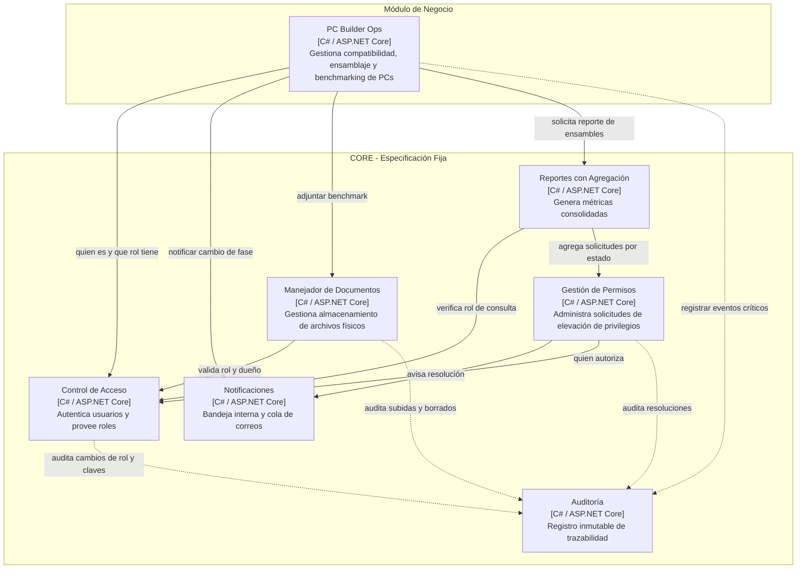

# PC Builder Ops

> **Sistema de Gestión de Ensamblaje y Pruebas de Computadoras Custom Para Empresas**  
> Proyecto de la asignatura **Programación III (TDS-007)** — ITLA (2026-C-3)

---

## Descripción del Proyecto
Plataforma orientada a talleres técnicos y tiendas especializadas de hardware para gestionar el ciclo operativo completo de computadoras personalizadas a pedido. El sistema valida la compatibilidad física y eléctrica de los componentes durante la cotización, coordina las etapas de montaje físico, y garantiza el control de calidad mediante el registro de pruebas de estrés térmico y estabilidad (benchmarking) antes de autorizar la entrega final al cliente.

## Stack Tecnológico
* **Lenguaje & Framework:** C# / .NET 10 (ASP.NET Core Web API)
* **Persistencia:** Entity Framework Core con base de datos relacional (SQL Server)
* **Autenticación & Seguridad:** JWT (JSON Web Tokens) con BCrypt y hashing salado
* **Arquitectura:** Diseño modular basado en componentes (C4 Nivel 3) con desacoplamiento estricto del Core

---

## Arquitectura del Sistema (Diagrama C4 Nivel 3)
El sistema se compone de seis piezas fijas del Core y el módulo de negocio independiente:


```mermaid
flowchart TD
    subgraph Core["CORE - Especificación Fija"]
        CA["Control de Acceso<br/>[C# / ASP.NET Core]<br/>Autentica usuarios y provee roles"]
        GP["Gestión de Permisos<br/>[C# / ASP.NET Core]<br/>Administra solicitudes de elevación de privilegios"]
        DOC["Manejador de Documentos<br/>[C# / ASP.NET Core]<br/>Gestiona almacenamiento de archivos físicos"]
        NOTI["Notificaciones<br/>[C# / ASP.NET Core]<br/>Bandeja interna y cola de correos"]
        REP["Reportes con Agregación<br/>[C# / ASP.NET Core]<br/>Genera métricas consolidadas"]
        AUD["Auditoría<br/>[C# / ASP.NET Core]<br/>Registro inmutable de trazabilidad"]
    end

    subgraph Negocio["Módulo de Negocio"]
        MOD["PC Builder Ops<br/>[C# / ASP.NET Core]<br/>Gestiona compatibilidad, ensamblaje y benchmarking de PCs"]
    end

    GP -->|"avisa resolución"| NOTI
    GP -->|"quien autoriza"| CA
    DOC -->|"valida rol y dueño"| CA
    REP -->|"verifica rol de consulta"| CA
    REP -->|"agrega solicitudes por estado"| GP

    CA -.->|"audita cambios de rol y claves"| AUD
    GP -.->|"audita resoluciones"| AUD
    DOC -.->|"audita subidas y borrados"| AUD

    MOD -->|"quien es y que rol tiene"| CA
    MOD -->|"notificar cambio de fase"| NOTI
    MOD -->|"adjuntar benchmark"| DOC
    MOD -->|"solicita reporte de ensambles"| REP
    MOD -.->|"registrar eventos críticos"| AUD
```

---

## Variables de Entorno Requeridas

Conforme a las directivas de seguridad **RF-NOT-13** y **RD-10**, ninguna credencial ni secreto se encuentra versionado en el código fuente. Configure las siguientes variables en el entorno de ejecución, consola o en su archivo local excluido de Git (`launchSettings.json`):

| Variable | Propósito |
|----------|-----------|
| `ConnectionStrings__DefaultConnection` | Cadena de conexión hacia la base de datos SQL Server. |
| `Jwt__Key` | Clave secreta simétrica utilizada para firmar los tokens JWT. |
| `Jwt__Issuer` | Identificador del emisor legítimo de los tokens emitidos. |
| `Jwt__Audience` | Audiencia permitida para el consumo de la API. |
| `SMTP_HOST` | Host del servidor SMTP para el despacho de correos (ej. smtp.gmail.com). |
| `SMTP_PORT` | Puerto de conexión al servidor SMTP (ej. 587 para STARTTLS). |
| `SMTP_USER` | Usuario o cuenta de correo autenticada ante el servidor SMTP. |
| `SMTP_PASS` | Contraseña de aplicación o token de autenticación SMTP. |
| `SMTP_FROM` | Dirección de remitente que figurará en el encabezado de los correos salientes. |

---

## Cómo ejecutar el proyecto

1. Clonar el repositorio y ubicarse en la etiqueta evaluada:

   ```bash
   git clone https://github.com/Joshua-Abreu/P3-PCBuilderOps.git
   cd P3-PCBuilderOps
   git checkout practica-1
   ```

2. Restaurar dependencias:

   ```bash
   dotnet restore
   ```

3. Configurar la base de datos:

   Asegure que la variable de conexión `ConnectionStrings__DefaultConnection` esté disponible en el entorno y ejecute las migraciones:

   ```bash
   dotnet ef database update --project src/Infrastructure --startup-project src/API
   ```

4. Compilar y levantar el servicio:

   ```bash
   dotnet build
   dotnet run --project src/API
   ```

   La API quedará escuchando en `http://localhost:5206` (o el puerto configurado en su perfil de host).

---

## Guía de Verificación de Criterios de Aceptación

Para reproducir y calificar cada criterio de aceptación de la Práctica 1, se provee el archivo de pruebas integrado `src/API/API.http`, el cual puede ejecutarse secuencialmente desde Visual Studio Code (extensión REST Client) o importarse en Postman.

### 1. Registro, Validación y Activación (Bloque 1.1)

| Criterio | Descripción | Resultado esperado |
|----------|-------------|-------------------|
| **RF-CA-01** (Registro exitoso) | Enviar `POST /api/auth/registro` con datos válidos. | Retorna `201 Created` y coloca un correo en estado Pendiente en `CorreosEnCola`. |
| **RF-CA-02** (Unicidad) | Volver a enviar el registro con el mismo correo. | Retorna rechazo controlado con mensaje neutro. |
| **RF-CA-14** (Política de contraseñas y validación) | Enviar registro con contraseña menor a 8 caracteres o correo sin formato RFC 5322. | Retorna `400 Bad Request` con el listado de fallos. |
| **RF-CA-15 / RF-CA-16** (Activación de cuenta) | Abrir el enlace recibido por correo o invocar `GET /api/auth/activar?token={token}`. | La cuenta pasa a estado activo (`200 OK`). Si se invoca por segunda vez el mismo token, se rechaza de forma controlado (`400 Bad Request`). |
| **RF-CA-17** (Reenvío neutro) | `POST /api/auth/reenviar-activacion` | Retorna siempre `200 OK` con mensaje neutro independientemente de si el correo existe, ya estaba activo o no existe. |

### 2. Autenticación y Control de Sesiones (Bloque 1.2)

| Criterio | Descripción | Resultado esperado |
|----------|-------------|-------------------|
| **RF-CA-03** (Credenciales inválidas) | `POST /api/auth/login` con credenciales incorrectas. | Responde con mensaje neutro sin revelar si falló el correo o la contraseña. |
| **RF-CA-07** (Consulta de identidad) | `GET /api/auth/yo` con cabecera `Authorization: Bearer <TOKEN>`. | Retorna el identificador, correo y rol del usuario en sesión. |
| **RF-CA-18** (Logout y revocación) | `POST /api/auth/logout` | Invalida el token en la tabla `SesionesUsuario`. Consultas subsecuentes a endpoints protegidos con dicho token son rechazadas con `401 Unauthorized`. |
| **RF-CA-19** (Protección contra fuerza bruta) | Enviar 5 intentos consecutivos con contraseña incorrecta para una misma cuenta. | El quinto intento bloquea temporalmente la cuenta por 15 minutos; cualquier intento posterior durante esa ventana es rechazado indicando el bloqueo. |

### 3. Roles y Administración de Usuarios (Bloques 1.3 y 1.4)

| Criterio | Descripción | Resultado esperado |
|----------|-------------|-------------------|
| **RF-CA-05 / RF-CA-06 / RF-CA-13** (Protección por rol) | Intentar consultar `GET /api/usuarios` sin token o con un token de usuario estándar. | Sin token: `401 Unauthorized`. Con token estándar: `403 Forbidden`. Solo el rol Administrador (Rol = 2) tiene acceso. |
| **RF-CA-08 / RF-CA-21** (Consulta paginada segura) | `GET /api/usuarios?pagina=1&tamanoPagina=10` | Lista usuarios aplicando paginación y filtros (activo, rol) sin exponer contraseñas, hashes ni tokens. |
| **RF-CA-04** (Creación administrativa) | `POST /api/usuarios` | Permite a un Administrador crear usuarios asignando directamente su rol. |
| **RF-CA-20** (Desactivación y reglas de autoprotección) | `PATCH /api/usuarios/{id}/estado` | Permite desactivar cuentas, revocando inmediatamente todas sus sesiones activas. Si un Administrador intenta auto-desactivar su propia cuenta o remover su propio rol de administrador, la solicitud es rechazada para prevenir el bloqueo total del sistema. |
| **RF-CA-22** (Cambio voluntario de contraseña) | Con sesión activa, `POST /api/auth/cambiar-password` | Exige ingresar la contraseña actual válida para poder establecer una nueva. Invalida las demás sesiones abiertas. |

### 4. Recuperación de Contraseña (Bloque 1.3)

| Criterio | Descripción | Resultado esperado |
|----------|-------------|-------------------|
| **RF-CA-09 / RF-CA-10** (Solicitud de recuperación) | `POST /api/auth/olvide-password` | Responde siempre de manera neutra (`200 OK`) y encola el token de recuperación en `CorreosEnCola`. |
| **RF-CA-11 / RF-CA-12** (Restablecimiento forzado) | `POST /api/auth/restablecer-password` | Recibe el token emitido y la nueva contraseña. Al procesarse con éxito, revoca todas las sesiones anteriores y marca el token como consumido impidiendo reutilizaciones. |

### 5. Cola de Correos y Despacho SMTP (Bloque 1.5)

| Criterio | Descripción | Resultado esperado |
|----------|-------------|-------------------|
| **RF-NOT-08 / RF-NOT-09** (Tolerancia a fallos) | El sistema encola notificaciones en `CorreosEnCola` sin interrumpir las operaciones de registro o recuperación aunque el servidor SMTP esté fuera de línea. | Las operaciones principales no se ven afectadas por la caída del servidor SMTP. |
| **RF-NOT-12** (Despacho e Idempotencia) | El servicio despachador en segundo plano (`EmailQueueWorker`) o el endpoint `POST /api/admin/correos/despachar` | Procesa los registros con estado `Pendiente`, los envía vía SMTP y actualiza el registro con `Estado = 'Enviado'` y su correspondiente `FechaEnvioUtc`. Si se vuelve a ejecutar el despachador, los correos ya enviados no se duplican. |

### 6. Estructura de la Máquina de Estados de Negocio (Bloque 1.6)

| Criterio | Descripción | Resultado esperado |
|----------|-------------|-------------------|
| **RF-NEG-03 / RD-04** | Las entidades del dominio central (`OrdenServicio`), sus estados (`EstadoOrdenServicio`) y la lógica de transición se encuentran centralizados en `src/Core/Ordenes/Domain/`. | Estructura centralizada y desacoplada. |
| **RF-NEG-04 / RF-NEG-05** | Se definen los 4 estados del taller (Recibida, EnDiagnostico, EnProceso, Entregada), la restricción terminal de Entregada, y la regla explícita de rechazo para el salto prohibido Recibida → Entregada. | Las transiciones inválidas son rechazadas con excepción controlada. |

Para consultar la matriz de transición completa y responsabilidades por rol, revise el documento formal: [`docs/maquina-de-estados.md`](docs/maquina-de-estados.md).
